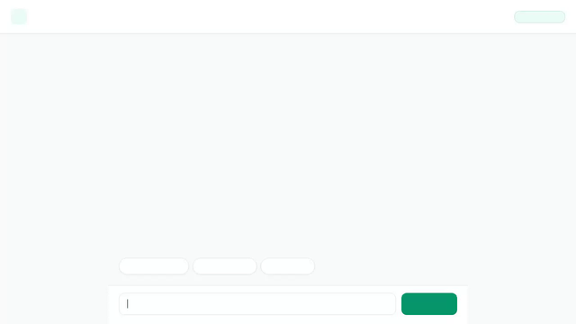

# Smart Pantry

A smart, conversational kitchen assistant built with the Google Agent Development Kit (ADK), Vertex AI Gemini models, Firestore, and Cloud Storage.



---

## 🌟 Overview

**Smart Pantry** helps home cooks organize their kitchen inventory, track item expiration dates, search real recipes, fetch USDA nutritional data, and generate visual food media—all accessible through a web chat interface supporting structured **A2UI** cards.

---

## 🛠️ Implemented Features & Cloud Services

This agent strictly implements the following tools and Google Cloud integrations:

- **Google Cloud Firestore Database**:
  - `list_pantry_items`: Queries the `pantry_items` collection with optional category filtering (e.g., *Dairy*, *Produce*, *Grains*).
  - `add_pantry_item`: Adds new ingredients and expiration records directly into Firestore.

- **ADK Memory Bank**:
  - `PreloadMemoryTool` & `generate_memories_callback`: Automatically extracts and remembers user dietary preferences, allergies, and kitchen facts across chat sessions.

- **Vertex AI / Gemini Image Generation & Cloud Storage**:
  - `generate_pantry_item_image`: Uses `gemini-3.1-flash-lite-image` in the `global` region to generate food photos. Saves bytes as a Playground artifact and uploads directly to a public Google Cloud Storage bucket (`smart-pantry-assets-qwiklabs-gcp-01-cec5bf0618af`).

- **Vertex AI / Gemini Video Generation & Cloud Storage**:
  - `generate_pantry_item_video`: Uses `gemini-omni-flash-preview` in the `global` region to generate short food videos, saving Playground artifacts and uploading to public Cloud Storage.

- **A2UI Rich Card System (v0.8)**:
  - Configured with `A2uiSchemaManager` (version 0.8) and `BasicCatalog`. Responses stream structured A2UI card surfaces (`Card`, `Column`, `Row`, `Text`, `Image`) rendered natively in the frontend.

- **Agent Engine Sandbox Code Execution**:
  - `AgentEngineSandboxCodeExecutor`: Safely executes Python code inside an Agent Engine sandbox environment for complex calculations or data analysis.

- **External API Integrations**:
  - `search_recipes`: Fetches recipe suggestions containing specific ingredients via TheMealDB API.
  - `get_food_nutrition_facts`: Retrieves USDA FoodData Central nutritional facts and caloric breakdowns.

- **Utility Tools**:
  - `get_weather`: Simulated weather lookup tool.
  - `get_current_time`: Timezone-aware time lookup tool.

---

## 🏗️ Architecture

```
User (Browser Chat UI)
       │
       ▼
FastAPI Proxy (frontend/main.py)
       │ (A2A Protocol)
       ▼
ADK Reasoning Engine Agent (app/agent.py)
  ├── Firestore (pantry_items collection)
  ├── Cloud Storage (smart-pantry-assets bucket)
  ├── Vertex AI Gemini (3.8-flash, 3.1-flash-lite-image, gemini-omni-flash-preview)
  ├── Agent Engine Sandbox Code Executor
  └── External APIs (TheMealDB, USDA FoodData Central)
```

---

## 🚀 Setup & Running Locally

### Prerequisites

- Python 3.11+
- Google Cloud SDK (`gcloud`) authenticated with Application Default Credentials (`gcloud auth application-default login`)

### Installation

1. Clone the repository and navigate to the project directory:
   ```bash
   cd my-agent
   ```

2. Install dependencies:
   ```bash
   pip install -r requirements.txt
   pip install -r frontend/requirements.txt
   ```

### Running the Agent CLI

Run the agent in interactive A2A mode:
```bash
agents-cli run --mode a2a
```

### Running the Web Chat Frontend Locally

1. Set the required environment variables:
   ```bash
   export AGENT_ENGINE_RESOURCE_NAME="<YOUR_AGENT_ENGINE_RESOURCE_NAME>"
   export AGENT_DIRECTORY="app"
   export PORT=8080
   ```

2. Start the FastAPI proxy server from the `frontend/` folder:
   ```bash
   cd frontend
   python main.py
   ```

3. Open your browser and navigate to the local port (port `8080`) to interact with the Smart Pantry web UI.

---

## 📁 Project Structure

```
.
├── app/
│   ├── agent.py          # Root agent definition, tools, system prompt & callbacks
│   ├── a2ui_utils.py     # A2UI callback and serialization utilities
│   └── fast_api_app.py   # FastAPI wrapper for local ADK testing
├── frontend/
│   ├── main.py           # FastAPI proxy server (A2A protocol client)
│   ├── requirements.txt  # Proxy dependencies
│   └── static/
│       └── index.html    # Rebranded Smart Pantry chat UI with A2UI renderer
├── agents-cli-manifest.yaml  # Agent manifest configuration
├── demo.gif              # Looping demo recording of Smart Pantry in action
└── README.md             # Project documentation
```
